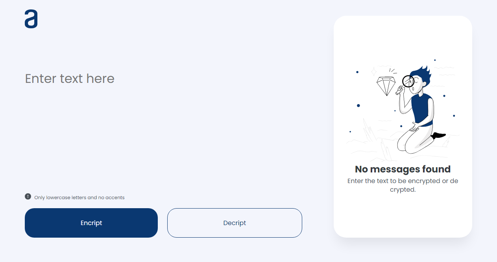

# 🔒 Encriptadaor de texto - Challenge ONE

Primer challenge del programa Oracle Next Education hecho con JavaScript.

Encuentra el desafío 👉 [aquí](https://em40a.github.io/Encriptador-de-Texto/) 

## Descripción ✍

Las "**llaves**" de encriptación que utilizaremos son las siguientes:

La letra "**e**" es convertida para "**enter**"
La letra "**i**" es convertida para "**imes**"
La letra "**a**" es convertida para "**ai**"
La letra "**o**" es convertida para "**ober**"
La letra "**u**" es convertida para "**ufat**"

Debe ser posible convertir una palabra encriptada a su versión original.
Por ejemplo:

"`gato`" => "gaitober"
"`gaitober`" => "gato"

Inclusive es posible copiar el texto encriptado/desencriptado con el boton de copiar! 📋✂️